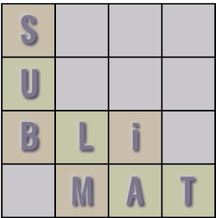

# Substitution-Matrix benchmarking with pairwise sequence alignment
(last active update April 2025)

  

Developer: Uriel Garcilazo Cruz

Date of project start: January 18th, 2025

This project is designed to benchmark the quality of pairwise alignments across popular substitution matrices.

The folders and files for this project are as follows:

docs - Documentation for the project  
refs - Reference material used for the project, including papers  
src - Source code  
test - Test cases  

<a href="https://ugarcil.github.io/UGarcil_capstone/" target="blank" style="font-size:2em;">Doxygen documentation</a>

For a detailed documentation on the software's architecture, please visit our Doxygen website:

https://ugarcil.github.io/UGarcil_capstone/
